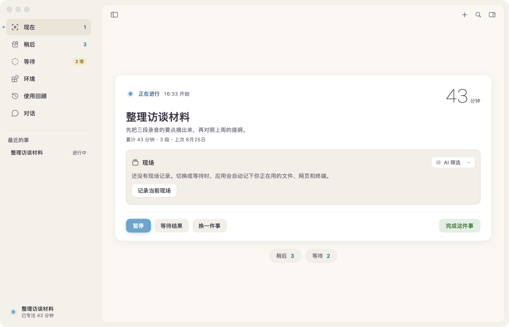

<div align="center">


# 轻锚 · Light Anchor

**你负责做事，它负责记得你做到哪儿了。**


</div>

写到一半被消息叫走，一件事卡在别人手里先去干别的——回来时，开着哪几个文件、下一步干什么，全得重新想。轻锚管的就是「切出去」这段时间：切走前自动记下现场，回来时原样交还。

没有账号，没有云端，也没有第 N 个待办清单——所有记录只在你自己的 Mac 上。



## 功能

- **现场**：切走时自动记下开着的文件、网页、终端和窗口；回来三行简报，一键恢复
- **记想法**：⌥⌘N 随手收，文字、语音、截图、链接都行，存完光标回到原处
- **换一件事**：⌘K 一下，放下的进度和现场都不丢，随时接着做
- **等待**：等回信、等确认的事交给它，到点来找你，不弹窗不抢前台
- **环境**：常做的事，一键打开要用的应用、文件和网页
- **回顾**：日、周、月的时间账，只记事实，不打分
- **记忆**：做过的事、等过的结果、记过的想法它都记得，「上周主要在忙什么」问一句就有答案
- **隐私**：数据全在本机，可导出、可备份、可彻底删除；AI 可选、逐项开关

## 安装

需要 macOS 15 或更新，目前从源码构建：

```bash
git clone https://github.com/stuttl/light-anchor.git
cd light-anchor
Scripts/build-release.sh
open dist/LightAnchor.app
```

## 开发

`swift run LightAnchor` 启动开发版，`swift test` 跑全部测试；构建、发布与数据格式见 [`docs/development.md`](./docs/development.md)。
